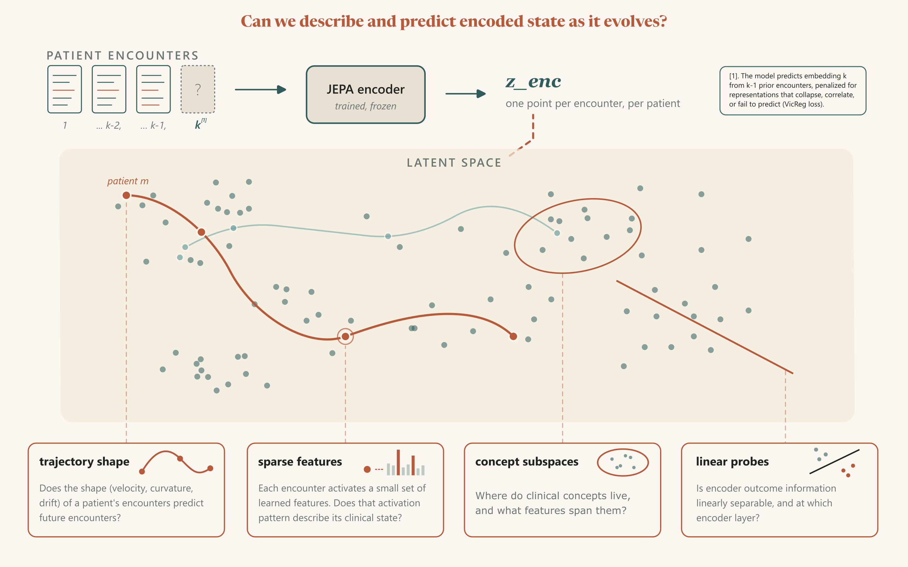

# chronos-lens

Interpretability analysis of Joint Embedding Predictive Architectures (JEPA) applied to longitudinal clinical encounter sequences from MIMIC-IV.



## Motivation

Standard mechanistic interpretability techniques, operating on autoregressive transformers, assume feature representations in token space. Furthermore, clinical ML models operating on temporal patient data demand interpretability, yet the representations they learn remain opaque. These techniques assume a lossy translation layer - that is: features depend on reconstructions of residual streams, losing valuable signal towards features in the process.

This project treats the JEPA's latent representations as first-class analytical objects, performing geometric analysis of the raw encoder, target, and predictor vectors, and cross-referencing with labels and clinical metadata. Specifically, the JEPA encodes patient encounter sequences (ICD codes, active medications) and predicts the embedding of a masked encounter given the remaining context. Three architectures are trained:
- **EMA** variant: exponential moving average target encoder, smooth L1 loss (Assran, 2023)
- **Stop-Gradient** variant: Shared encoder, blocked gradients on the target path, VICReg regularization
- **Supervised transformer** baseline

The forward pass returns three objects:

- **`z_enc`** `(B, C, D)`: per-encounter encoder representations - what the encoder learns about each clinical encounter
- **`z_pred`** `(B, D)`: the predictor's output for the masked encounter - what the model expects to see
- **`z_target`** `(B, D)`: the target encoder's representation of the masked encounter - what's actually there

**pred_error (pred $-$ target)** - what the model gets wrong - is also computed for analysis.

Interpretability is probe-based and SAE-focused: linear probes on `z_enc` and `z_pred` test what clinical information is preserved and predicted, while sparse autoencoders on encoder representations and prediction errors decompose the geometry into sparse features.

Core questions:

- What clinical information does the encoder preserve per encounter? (probe `z_enc`)
- What does the predictor expect the masked encounter to contain? (probe `z_pred`)
- Where do predictions diverge from reality, and do those errors have clinical structure? (SAE on `P−T`)
- Do sparse autoencoder features on encoder representations correspond to clinically meaningful phenotypes? (SAE on `z_enc`)
- Can we map latent space embedding predictions to untampered features?

## Usage

### Setup
```bash
pip install torch --index-url https://download.pytorch.org/whl/cu126
pip install -e .
```

Requires Python $\geq$ 3.12.

### Data extraction

Requires MIMIC-IV access via BigQuery:
1. [Acquire PhysioNet credentials](https://physionet.org/content/mimiciv/)
2. [Link PhysioNet account to a GCP project](https://physionet.org/settings/cloud/)
3. Authenticate locally:

```bash
gcloud auth application-default login
gcloud config set project <your-project-id>
```

4. Update `BQ_PROJECT_ID` in `scripts/extract_mimic.py`
5. Run extraction:

```bash
python -m scripts.extract_mimic
```

### Training

A single flat config, `experiments/<run-id>.yaml`, fully defines a run: the core model architecture (stop-gradient JEPA, EMA JEPA, or supervised baseline), its training hyperparameters, and the downstream SAE settings. A run first trains the encoder/predictor (or supervised baseline), then optionally fits a sparse autoencoder post-hoc on a chosen target vector. All checkpoints, logs, and extracted embeddings are written out-of-repo to `artifacts/training-runs/<run-id>/`.

```bash
# Core model — `model` is the default subcommand, so it can be omitted.
# Stop-gradient JEPA
python -m scripts.train --exp stopg_42_v01

# EMA (Classic) JEPA
python -m scripts.train --exp ema_42_v01

# Supervised baseline
python -m scripts.train --exp supervised_v01

# SAE on a trained run (pick a target vector + embeddings file)
python -m scripts.train --exp stopg_42_v01 sae --target z_enc --embeddings embeddings_40.npz
```

Runs are configured via `experiments/<run-id>.yaml` (one flat config file per run). If a run directory already has checkpoints/logs, a new versioned directory is created automatically (e.g., `stopg_42_v01` -> `stopg_42_v01_v01-1`).

### Analysis

Analysis is consolidated into a handful of `scripts/analyze_*.py` entry points (trajectory geometry, label-first SAE features, subspace composition, and JEPA-vs-supervised comparison), each running a family of related analyses over a trained run's frozen embeddings. Every script reads from `artifacts/training-runs/<run-id>/` and writes structured results back under `results/` as paired `.json` (scalars) and `.npz` (large arrays) files.

```bash
# Per-run lenses — each reads/writes artifacts/training-runs/<run-id>/results/
python -m scripts.analyze_trajectories --exp stopg_42_v01 --emb embeddings_40.npz
python -m scripts.analyze_features     --exp stopg_42_v01 --sae z_enc --emb embeddings_40.npz
python -m scripts.analyze_composition  --exp stopg_42_v01 --sae z_enc --emb embeddings_40.npz

# JEPA vs supervised baseline (trailing --jepa-sae/--sup-sae are optional)
python -m scripts.analyze_comparison \
    --jepa-exp stopg_42_v01     --jepa-emb embeddings_40.npz \
    --sup-exp  supervised_64_42 --sup-emb  embeddings_20.npz \
    [--jepa-sae sae_pred_error  --sup-sae sae_z_enc]

# Re-extract embeddings from a checkpoint (resolves local -> S3 -> compute)
python -m scripts.embeddings extract --exp stopg_42_v01 --ckpt checkpoint_100.pt
```
